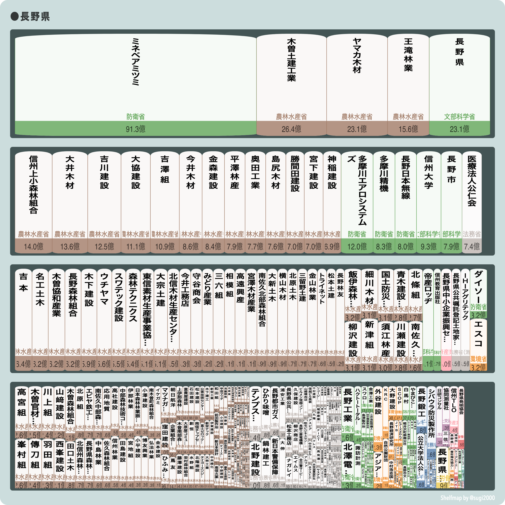
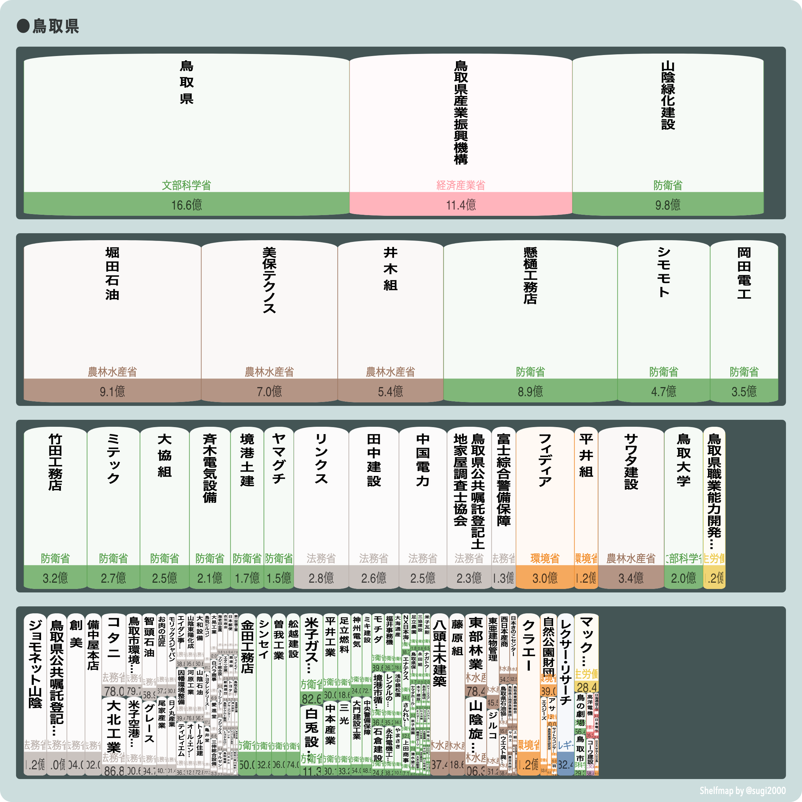

# 都道府県別 調達金額の大きい法人

データ：gBizINFOから2022年9月6日にダウンロードしたデータ

注意：

- 1件1兆円以上以上のデータは誤データと思われるので除外しています。

## 北海道

## 青森県

## 岩手県

## 宮城県

## 秋田県

## 山形県

## 福島県

## 茨城県

## 栃木県

## 群馬県

## 埼玉県

## 千葉県

## 東京都

## 神奈川県

## 新潟県

## 富山県

## 石川県

## 福井県

## 山梨県

## 長野県

## 岐阜県

## 静岡県

## 愛知県

## 三重県

## 滋賀県

## 京都府

## 大阪府

## 兵庫県

## 奈良県

## 和歌山県

## 鳥取県

## 島根県

## 岡山県

## 広島県

## 山口県

## 徳島県

## 香川県

## 愛媛県

## 高知県

## 福岡県

## 佐賀県

## 長崎県

## 熊本県

## 大分県

## 宮崎県

## 鹿児島県

## 沖縄県

